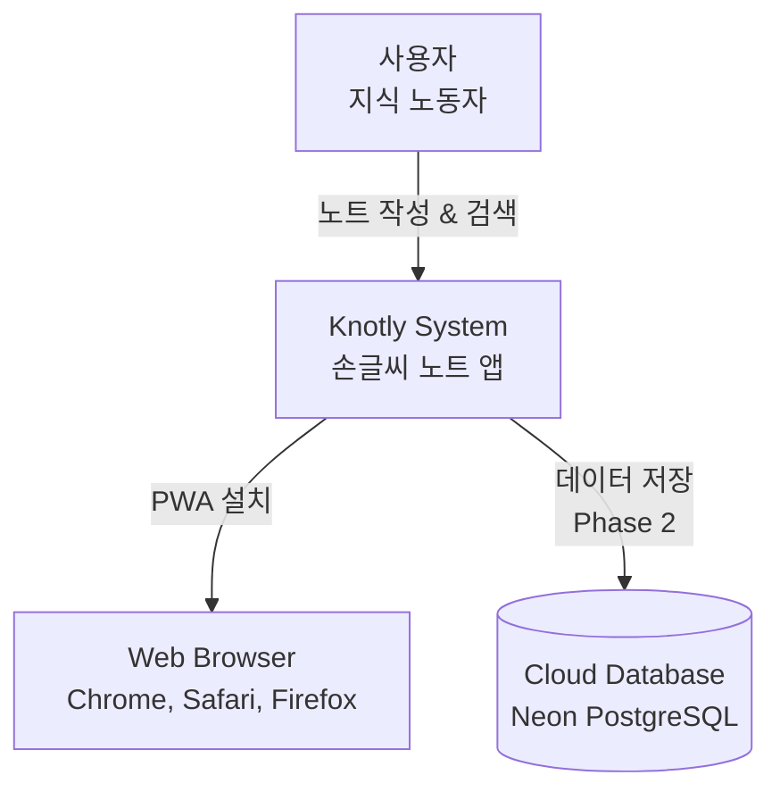
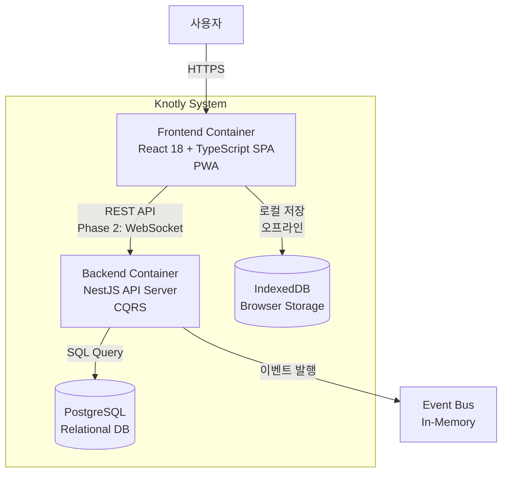
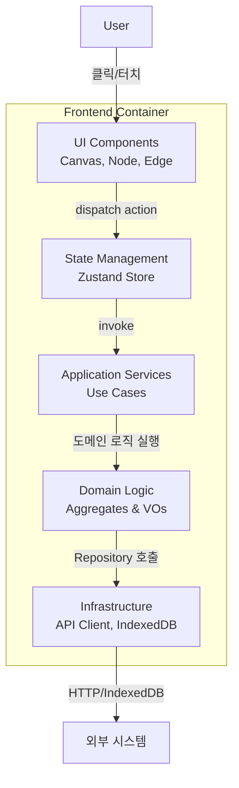
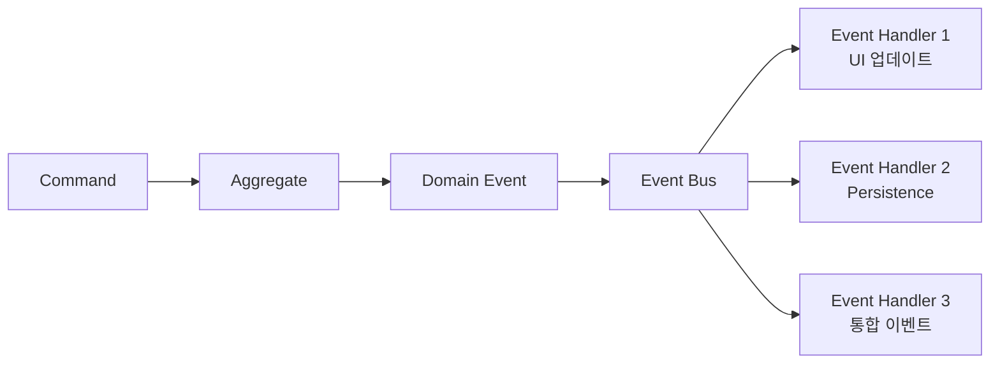

# Knotly 시스템 아키텍처

> C4 Model을 활용한 시스템 아키텍처 문서

## C4 Level 1: System Context



**시스템 컨텍스트 설명**:
- **사용자**: 개발자, 학생, 기획자 등 지식 노동자
- **Knotly**: 손글씨 노트 애플리케이션
- **Browser**: PWA로 설치되어 오프라인 동작
- **Cloud DB**: Phase 2에서 실시간 협업을 위한 서버 동기화

---

## C4 Level 2: Container Diagram



**Container 설명**:

### Frontend Container
- **기술**: React 18, TypeScript, Vite, PWA
- **책임**: UI 렌더링, 사용자 인터랙션, 오프라인 저장
- **배포**: Vercel / Netlify

### Backend Container (Phase 2)
- **기술**: NestJS, CQRS, Prisma
- **책임**: 비즈니스 로직, 데이터 영속성, 실시간 동기화
- **배포**: Railway / Fly.io

### PostgreSQL Database
- **기술**: PostgreSQL 15
- **책임**: 중앙 데이터 저장소
- **배포**: Neon / Supabase

### IndexedDB Cache
- **기술**: Browser IndexedDB
- **책임**: 로컬 오프라인 저장
- **위치**: 사용자 브라우저

---

## C4 Level 3: Component Diagram (Frontend)



**Component 설명**:

### 1. UI Components
- Canvas (캔버스 렌더링)
- Node (노드 컴포넌트)
- Edge (연결선 컴포넌트)
- Toolbar (도구 모음)
- SearchBar (검색바)

### 2. State Management (Zustand)
- `canvasStore`: 캔버스 상태 (줌, 팬, 그리드)
- `graphStore`: 노드/엣지 상태
- `searchStore`: 검색 쿼리 & 결과

### 3. Domain Logic
- `Node` Aggregate
- `Edge` Aggregate
- Value Objects (Position, Content, Style)

### 4. Application Services
- `CreateNodeUseCase`
- `MoveNodeUseCase`
- `ConnectNodesUseCase`
- `SearchNodesUseCase`

### 5. Infrastructure
- `NodeRepositoryImpl` (IndexedDB)
- `EdgeRepositoryImpl` (IndexedDB)
- `ApiClient` (Phase 2)

---

## C4 Level 4: Code (예시)

### Node Aggregate 클래스 다이어그램

```typescript
class Node {
  - id: NodeId
  - position: Position
  - content: Content
  - style: Style
  - createdAt: Date
  - updatedAt: Date

  + static create(params): Node
  + moveTo(position: Position): void
  + updateContent(content: Content): void
  + changeStyle(style: Style): void
}

class Position {
  - x: number
  - y: number
  + isWithinCanvas(): boolean
}

class Content {
  - text: string
  - emoji?: string
  + exceedsLimit(): boolean
}

Node *-- Position
Node *-- Content
Node *-- Style
```

---

## 레이어드 아키텍처 (Frontend)

```
┌─────────────────────────────────────────┐
│         Presentation Layer              │
│   (React Components, UI)                │
└─────────────┬───────────────────────────┘
              │
┌─────────────▼───────────────────────────┐
│       Application Layer                 │
│   (Use Cases, Application Services)     │
└─────────────┬───────────────────────────┘
              │
┌─────────────▼───────────────────────────┐
│          Domain Layer                   │
│   (Aggregates, VOs, Domain Events)      │
└─────────────┬───────────────────────────┘
              │
┌─────────────▼───────────────────────────┐
│      Infrastructure Layer               │
│   (IndexedDB, API Client, Adapters)     │
└─────────────────────────────────────────┘
```

**레이어 의존성 규칙**:
- Presentation → Application → Domain ← Infrastructure
- Domain Layer는 다른 레이어에 의존하지 않음 (의존성 역전 원칙)

---

## 백엔드 아키텍처 (Phase 2)

### CQRS 패턴

```
┌──────────────────┐         ┌──────────────────┐
│  Command Side    │         │   Query Side     │
│  (Write Model)   │         │   (Read Model)   │
└────────┬─────────┘         └────────┬─────────┘
         │                            │
         ▼                            ▼
  ┌─────────────┐            ┌─────────────┐
  │  Event      │───────────▶│  Read DB    │
  │  Store      │  Projection│  (Optimized)│
  └─────────────┘            └─────────────┘
```

**Command Side**:
- `CreateNodeCommand` → `NodeAggregate.create()`
- `MoveNodeCommand` → `NodeAggregate.moveTo()`

**Query Side**:
- `GetAllNodesQuery` → Read DB (비정규화된 DTO)
- `SearchNodesQuery` → Elasticsearch (Phase 3)

---

## 이벤트 기반 아키텍처



**이벤트 플로우**:
1. Command 실행 → Aggregate 상태 변경
2. Domain Event 발행
3. Event Bus로 전파
4. 여러 Handler가 병렬로 처리

---

## 배포 아키텍처

### MVP (Milestone 1-5)

```
┌──────────────────────────────────────┐
│         Vercel (Frontend)            │
│  - Static Site Hosting               │
│  - CDN (Global Edge Network)         │
│  - HTTPS + Custom Domain             │
└──────────────────────────────────────┘
         │
         │ (IndexedDB만 사용)
         ▼
   ┌──────────────┐
   │   Browser    │
   │  (IndexedDB) │
   └──────────────┘
```

### Phase 2 (실시간 협업)

```
┌────────────────┐      ┌────────────────┐
│    Vercel      │      │    Railway     │
│   (Frontend)   │◄────►│   (Backend)    │
└────────────────┘ REST  └────┬───────────┘
                        WebSocket
                              │
                              ▼
                     ┌─────────────────┐
                     │  Neon (DB)      │
                     │  PostgreSQL 15  │
                     └─────────────────┘
```

---

## 보안 아키텍처 (Phase 2)

```
User Request
    │
    ▼
┌────────────────┐
│  API Gateway   │  ← Rate Limiting (100 req/min)
└────────┬───────┘
         │
         ▼
┌────────────────┐
│  JWT Auth      │  ← Bearer Token 검증
└────────┬───────┘
         │
         ▼
┌────────────────┐
│  Authorization │  ← RBAC (Owner/Editor/Viewer)
└────────┬───────┘
         │
         ▼
┌────────────────┐
│  NestJS API    │
└────────────────┘
```

---

## 성능 최적화 전략

### Frontend
- **Code Splitting**: Route-based lazy loading
- **Virtualization**: 100개 이상 노드 시 Canvas Virtualization
- **Debouncing**: 500ms 자동 저장
- **Memoization**: React.memo, useMemo로 불필요한 리렌더링 방지

### Backend (Phase 2)
- **Connection Pooling**: PgBouncer (max 100 connections)
- **Caching**: Redis for frequently accessed data
- **Query Optimization**: Prisma로 N+1 문제 해결

---

## 확장성 (Scalability)

### Horizontal Scaling (Phase 3)

```
      Load Balancer
           │
    ┌──────┼──────┐
    ▼      ▼      ▼
  API-1  API-2  API-3
    │      │      │
    └──────┼──────┘
           │
     PostgreSQL
      (Primary)
           │
    ┌──────┴──────┐
    ▼             ▼
 Replica-1    Replica-2
```

---

## 모니터링 & 로깅

```
Application
    │
    ├──► Logs → CloudWatch / Datadog
    ├──► Metrics → Prometheus + Grafana
    └──► Tracing → OpenTelemetry
```

**핵심 지표**:
- Response Time (p50, p95, p99)
- Error Rate
- Database Connection Pool 사용률
- IndexedDB 저장 성공률

---

**작성일**: 2025-10-17
**마지막 업데이트**: 2025-10-17
