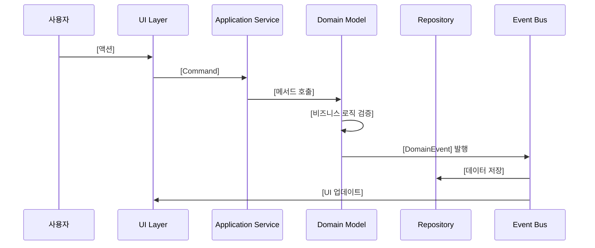
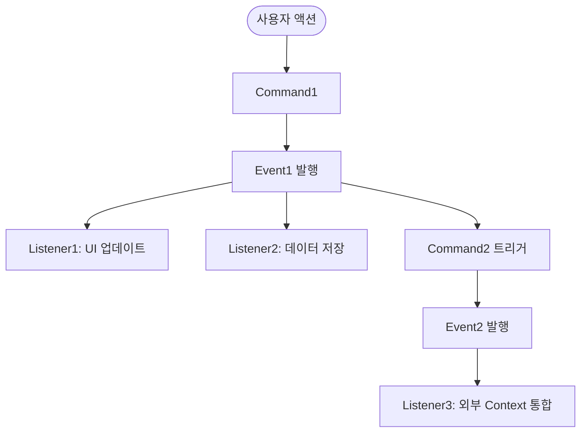

# [DOMAIN_NAME] Event Storming

> 이벤트 스토밍 세션 결과를 기록하고 도메인 이벤트 흐름을 시각화합니다.

## 📅 세션 정보

**일시**: [YYYY-MM-DD]
**참여자**: [이름들]
**목표**: [DOMAIN_NAME] 도메인의 이벤트 흐름 파악

---

## 🎬 사용자 시나리오

### 시나리오 1: [시나리오 이름]

**사용자 스토리**:
> [사용자]는 [목적]을 위해 [행동]을 한다.

**단계**:
1. [단계 1]
2. [단계 2]
3. [단계 3]

---

## 🔄 이벤트 타임라인

### Timeline: [주요 흐름 이름]



**설명**:
- [단계별 설명]

---

## 📌 도메인 이벤트 목록

### 핵심 이벤트 (MVP)

| 이벤트 이름 | 발생 시점 | Aggregate | Payload | 구독자 |
|------------|----------|-----------|---------|--------|
| `[EventName1]` | [언제] | [Aggregate] | `{ field1, field2 }` | [Context1, Context2] |
| `[EventName2]` | [언제] | [Aggregate] | `{ field1, field2 }` | [Context1] |
| `[EventName3]` | [언제] | [Aggregate] | `{ field1, field2 }` | [Context1] |

### Phase 2 이벤트

| 이벤트 이름 | 발생 시점 | Aggregate | Payload | 구독자 |
|------------|----------|-----------|---------|--------|
| `[EventName4]` | [언제] | [Aggregate] | `{ field1, field2 }` | [Context1, Context2] |

---

## 🎯 Command & Event Mapping

### Command 1: [CommandName]

**Command Payload**:
```typescript
interface [CommandName] {
  field1: Type1;
  field2: Type2;
}
```

**처리 흐름**:
1. 검증: [검증 내용]
2. 실행: [비즈니스 로직]
3. 이벤트 발행: `[EventName]`

**발생 가능한 이벤트**:
- ✅ 성공: `[SuccessEvent]`
- ❌ 실패: `[FailureEvent]`

---

### Command 2: [CommandName]

_(위와 동일한 구조)_

---

## 🔴 Hot Spots (복잡도 높은 영역)

### Hot Spot 1: [이슈 제목]

**문제**:
[어떤 복잡한 상황인가?]

**해결 방안**:
[어떻게 해결할 것인가?]

**ADR 링크**: [ADR-00X](./domain.md#adr-00x)

---

## 📊 이벤트 흐름 다이어그램 (전체)



---

## 📝 Aggregate 경계 식별

Event Storming을 통해 식별된 Aggregate:

### Aggregate 1: [AGGREGATE_NAME]

**포함된 이벤트**:
- `[Event1]`
- `[Event2]`
- `[Event3]`

**트랜잭션 경계**: [설명]

---

### Aggregate 2: [AGGREGATE_NAME]

_(위와 동일한 구조)_

---

## 🧪 테스트 시나리오

Event Storming 결과를 기반으로 한 테스트 시나리오:

### 시나리오 1: [테스트 이름]

**Given** (초기 상태):
- [상태 1]
- [상태 2]

**When** (액션):
- [Command 실행]

**Then** (기대 결과):
- [Event 발행 확인]
- [상태 변화 확인]

```typescript
// 테스트 코드 예시
describe('[AGGREGATE_NAME]', () => {
  it('should publish [EventName] when [condition]', () => {
    // Given
    const aggregate = createAggregate();

    // When
    aggregate.methodName(params);

    // Then
    expect(aggregate.getUncommittedEvents()).toContain(
      new [EventName](expectedPayload)
    );
  });
});
```

---

## ✅ 완료 체크리스트

- [ ] 핵심 사용자 시나리오 작성 완료
- [ ] 도메인 이벤트 타임라인 작성 완료
- [ ] Command와 Event 매핑 완료
- [ ] Aggregate 경계 식별 완료
- [ ] Hot Spots 문서화 완료
- [ ] 테스트 시나리오 작성 완료

---

**작성일**: [YYYY-MM-DD]
**마지막 업데이트**: [YYYY-MM-DD]
