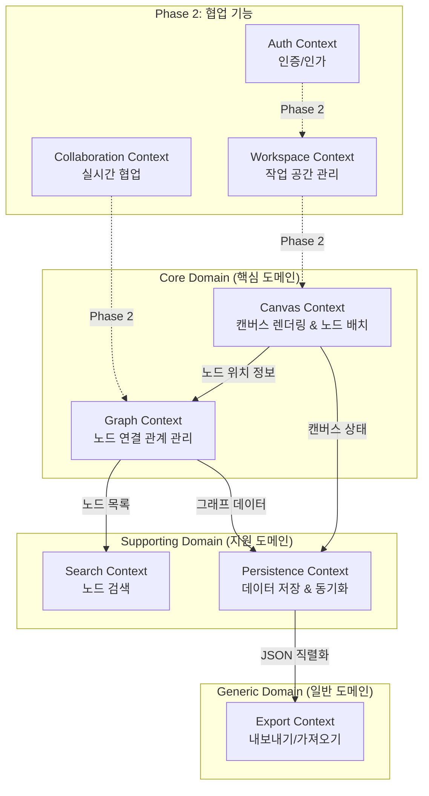

# Knotly Context Map

> Bounded Context 간의 관계를 정의하고 시각화합니다.

## Context Map 다이어그램

## Bounded Context 정의

### 1. Canvas Context (핵심)

**책임**:
- 캔버스 렌더링 (그리드 배경)
- 노드 배치 및 드래그
- 줌/팬 제스처
- rough.js 손그림 렌더링

**Ubiquitous Language**:
- Canvas, Grid, Viewport, Position, DragGesture

**관계**:
- → Graph Context: 노드 위치 정보 제공
- → Persistence Context: 캔버스 상태 저장

---

### 2. Graph Context (핵심)

**책임**:
- Node 생성/편집/삭제
- Edge 연결 관리
- @멘션 자동 연결
- CASCADE 삭제

**Ubiquitous Language**:
- Node, Edge, Connection, Mention, Aggregate

**관계**:
- ← Canvas Context: 노드 위치 받음
- → Search Context: 검색 가능한 노드 목록 제공
- → Persistence Context: 그래프 데이터 저장

---

### 3. Search Context (지원)

**책임**:
- Fuse.js 퍼지 검색
- 검색 히스토리 관리
- 고급 필터 (타입/색상/날짜)

**Ubiquitous Language**:
- SearchQuery, SearchResult, Filter, FuzzyMatch

**관계**:
- ← Graph Context: 노드 목록 받음

---

### 4. Persistence Context (지원)

**책임**:
- IndexedDB 로컬 저장
- 500ms 디바운싱 자동 저장
- Service Worker 캐싱 (PWA)

**Ubiquitous Language**:
- Repository, Debounce, Cache, Offline

**관계**:
- ← Canvas Context: 캔버스 상태 저장
- ← Graph Context: 그래프 데이터 저장
- → Export Context: JSON 직렬화

---

### 5. Export Context (일반)

**책임**:
- JSON 내보내기/가져오기
- 데이터 백업/복구

**Ubiquitous Language**:
- Export, Import, Backup, Restore

**관계**:
- ← Persistence Context: 데이터 직렬화

---

## Phase 2 Contexts (실시간 협업)

### 6. Auth Context

**책임**:
- 회원가입/로그인
- JWT 인증
- 소셜 인증 (Google, GitHub)

**Ubiquitous Language**:
- User, Credential, Token, Session

---

### 7. Workspace Context

**책임**:
- 워크스페이스 생성/관리
- 멀티 워크스페이스 지원
- 권한 관리

**Ubiquitous Language**:
- Workspace, Owner, Member, Permission

---

### 8. Collaboration Context

**책임**:
- Socket.io 실시간 동기화
- 커서 위치 공유
- 충돌 해결 (Last Write Wins)

**Ubiquitous Language**:
- Cursor, Conflict, Synchronization, Event

---

## 통합 이벤트 (Integration Events)

Bounded Context 간에 발행/구독하는 이벤트:

| 이벤트 | 발행자 | 구독자 | 목적 |
|--------|--------|--------|------|
| `NodeCreated` | Graph | Canvas, Search, Persistence | 새 노드 렌더링/검색/저장 |
| `NodeMoved` | Canvas | Graph, Persistence | 위치 업데이트 |
| `EdgeCreated` | Graph | Canvas, Persistence | 선 렌더링 및 저장 |
| `WorkspaceLoaded` | Workspace | Canvas, Graph | 캔버스 초기화 |

---

## 개발 우선순위

1. **Milestone 1-5 (MVP)**: Canvas + Graph + Search + Persistence
2. **Milestone 6**: Export
3. **Phase 2**: Auth + Workspace + Collaboration

---

**마지막 업데이트**: 2025-10-17
